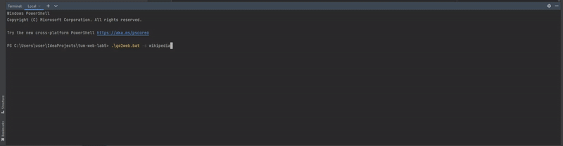

# Lab5 - go2web - Custom HTTP Client

A command-line HTTP client implementation that makes HTTP/HTTPS requests without using built-in HTTP libraries.



## Features

- Make HTTP/HTTPS requests to any URL
- Search the web using DuckDuckGo
- Display human-readable responses (no HTML tags)
- HTTP redirect handling (up to 5 redirects)
- Interactive search results navigation
- HTTP caching mechanism
- Content negotiation for HTML and JSON

## Requirements

- Java 8 or higher

## Installation

1. Clone the repository
2. Compile the Java code:
```
# Using Maven
mvn compile

# Or manually
javac -d target/classes src/main/java/org/example/Go2Web.java
```

## Usage

```
go2web -u <URL>         # make an HTTP request to the specified URL and print the response
go2web -s <search-term> # make an HTTP request to search the term and print top 10 results
go2web -h               # show this help
```

## Examples

### Getting a web page
```
go2web -u example.com
```

### Searching the web
```
go2web -s java programming
```

## Implementation Details

- **Basic HTTP Client**: Implemented using raw Java Socket API
- **HTTPS Support**: Using SSLSocket for secure connections
- **Human-readable Output**: Removes HTML tags, formats content nicely
- **Redirect Handling**: Automatically follows HTTP redirects
- **Search Functionality**: Extracts search results
- **Interactive Feature**: Allows selecting and accessing search results
- **Caching Mechanism**: Saves responses locally with TTL
- **Content Negotiation**: Different handling for HTML vs JSON

## Development Process

This project was developed in several stages:

1. Basic project structure with CLI parser
2. Simple HTTP request implementation
3. HTML cleaning for human-readable output
4. HTTPS support and redirect handling
5. Search functionality with result extraction
6. HTTP cache mechanism
7. Content negotiation

No HTTP libraries were used in this implementation. All HTTP functionality was built using only native Java socket APIs.